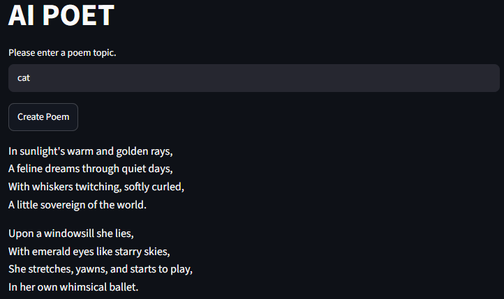

# AI Poet

An AI-powered poetry generator built with **Streamlit**, **LangChain**, and **OpenAI**.

Users can enter a topic, and the AI generates an original poem in real time.

> 🚧 This project is currently under development.

---

## Features

- Generate poems from a user-provided topic
- Interactive web interface built with Streamlit
- Loading spinner while the AI generates a poem
- Secure API key management with python-dotenv
- Powered by LangChain and OpenAI GPT-4o mini

---

## Tech Stack

- Python
- Streamlit
- LangChain
- LangChain-OpenAI
- OpenAI API
- python-dotenv

---

## Project Structure

```
AI-Poet/
├── images/
│   └── preview.png
├── main.py
├── requirements.txt
├── .env
├── .gitignore
└── README.md
```

---

## Installation

```bash
git clone https://github.com/your-username/langchain-poet.git
cd langchain-poet

pip install -r requirements.txt
```

Create a `.env` file.

```env
OPENAI_API_KEY=your_api_key
```

Run the application.

```bash
python -m streamlit run main.py
```

---

## Preview



---

## Future Improvements

- Select poem style (Romantic, Haiku, Sonnet, etc.)
- Choose poem length
- Support multiple languages
- Export poems as PDF
- Save poem history